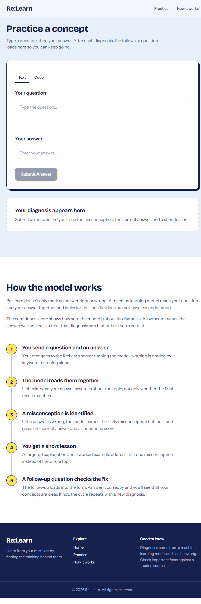
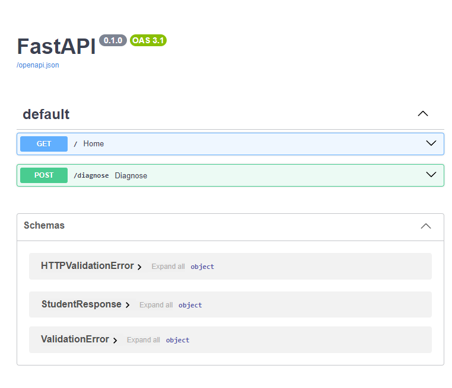
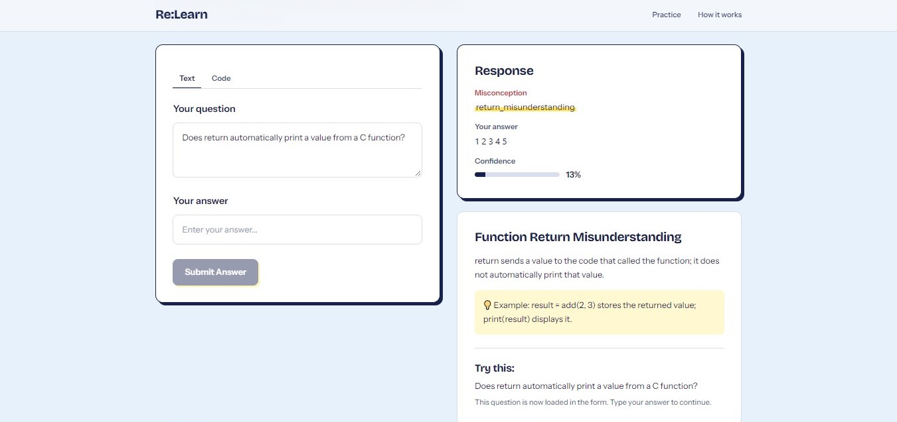
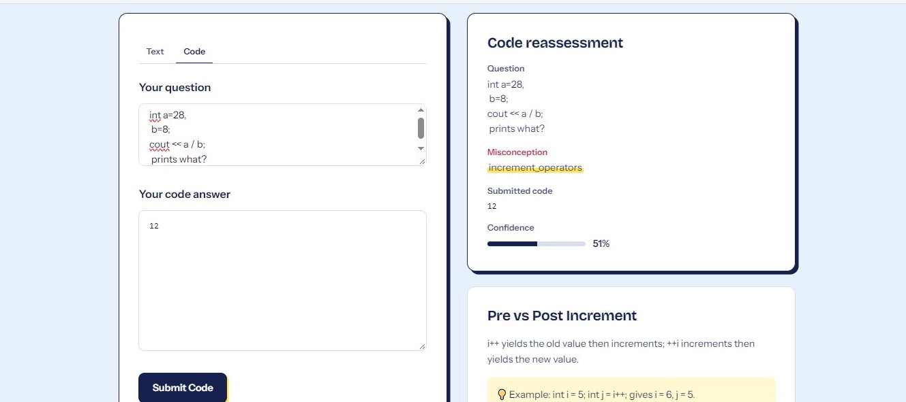

# Re:Learn

Re:Learn is a learning platform that helps students understand _why_ an answer may
be wrong. A simple interface sends a question and response to a FastAPI service,
which uses a text-classification model to identify a likely misconception and
return a short explanation, example, and a follow-up question.

## Features

- Practice with a question and a text or code response.
- For Code mode, enter the task in Text mode first, then switch to Code and
  submit your code as the answer to that task.
- View a likely misconception, the expected answer , model
  confidence, and a targeted intervention.
- Continue with a follow-up question when one is provided.

  ## Model and intervention data

The training data is in `ml-service/data/misconceptions.csv`. The training
script validates its columns, evaluates a stratified holdout split, then fits a
TF-IDF and logistic-regression pipeline on the retained examples and writes
`ml-service/models/misconception_model.pkl`.

Intervention content is stored in `ml-service/interventions.py`.

For unseen questions, the service checks that the predicted misconception is
supported by similar training questions; if not, it asks for clarification
instead of returning an unrelated category.

## Screenshots

### Practice interface



### ML service API



### Demo Results






## Project structure
```
.
├── client/                  # React, Vite, and Tailwind CSS frontend
│   └── src/
├── ml-service/
│   ├── data/
│   │   └── misconceptions.csv
│   ├── models/               # Generated model files (ignored by Git)
│   ├── training/
│   │   └── train.py
│   ├── interventions.py      # Explanations and follow-up questions
│   ├── main.py               # FastAPI application
│   └── requirements.txt
└── screenshots/
    ├── client.png
    └── ml-server.png
```
